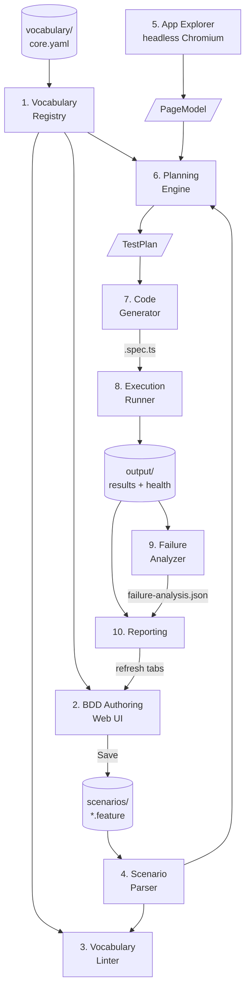
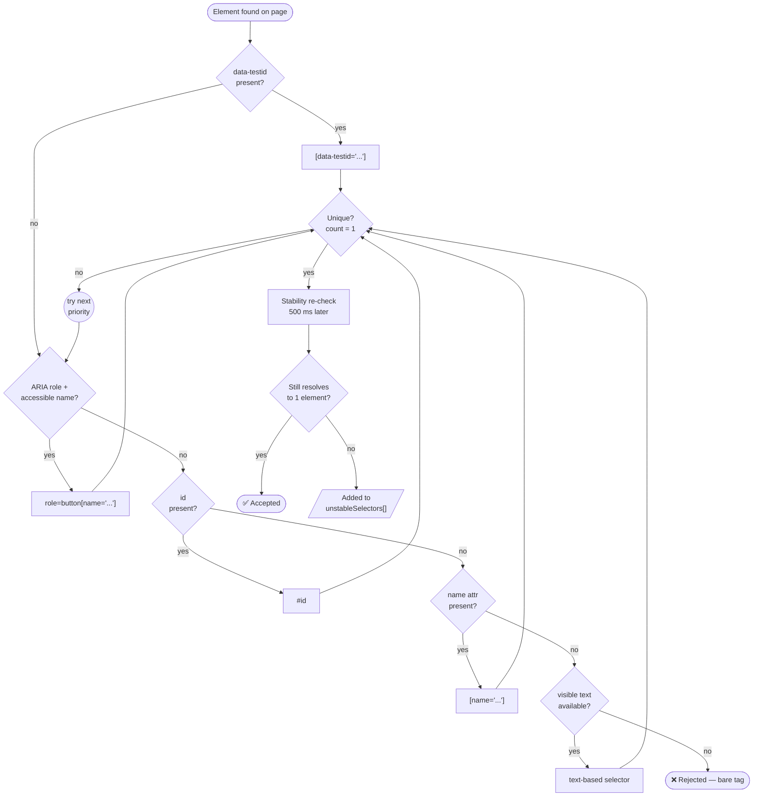
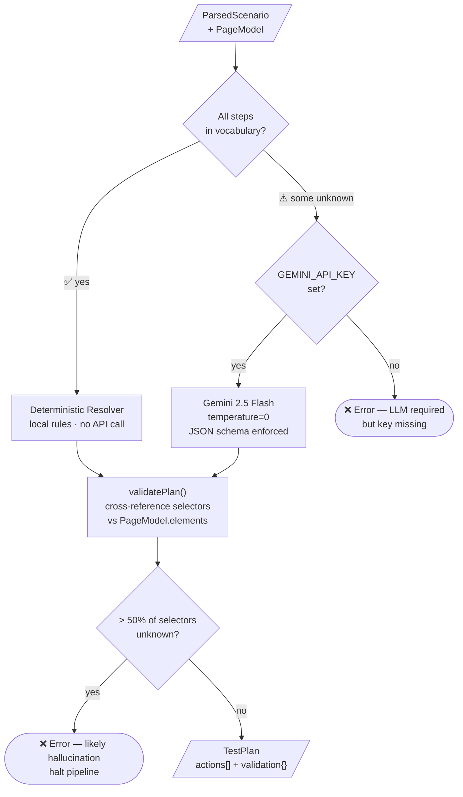

# AI-Driven QA Platform — Component Reference

**Audience:** Engineers who need to understand each subsystem's inputs, outputs, key files, and design decisions.
**Scope:** All 10 MVP subsystems.

---

## Component Interaction Map



---

## 1. Vocabulary Registry

**What it does**
Loads a YAML vocabulary file containing canonical step definitions (actions and assertions) and exposes two lookup functions used by the linter, planner, and autocomplete: `matchStep()` for exact and fuzzy matching, and `findClosest()` for suggestion generation.

**Key files**
- `src/vocabulary/registry.ts`
- `vocabulary/core.yaml`

**Input**
A raw BDD step string, e.g. `"enter username tomsmith"`.

**Output**
- `matchStep()` returns a match object `{ entry, params }` or `null`. The `params` field contains extracted placeholder values (e.g. `{ value: "tomsmith" }` for the pattern `enter username {value}`).
- `findClosest()` returns the single best-scoring candidate entry for use in lint suggestions.

**How matching works**
`matchStep()` first normalises the input: strips a leading `"I "` or `"we "` prefix, lowercases, trims whitespace. It then attempts an exact match against all vocabulary entries. If no exact match is found, it scores each entry using token overlap and returns the highest-scoring result above a minimum threshold.

**Example**

```
matchStep("enter username tomsmith")
  → { entry: { pattern: "enter username {value}", ... }, params: { value: "tomsmith" } }
```

**Design decisions**
The vocabulary YAML carries a `version` field (e.g. `version: 1.1.0`) and a `changelog:` section with dated entries. This version is stamped into the provenance header of every generated spec, making it possible to trace a spec back to the exact vocabulary state it was generated from.

---

## 2. BDD Authoring (Web UI)

**What it does**
Provides a browser-based editor for writing and saving `.feature` files. Includes Gherkin syntax highlighting, vocabulary-aware autocomplete, file management, and a lint-on-demand button.

**Key files**
- `src/server/public/index.html`
- `src/server/server.ts`

**Input**
User keystrokes in the Monaco editor; file names selected from the file picker.

**Output**
`.feature` files persisted to the `scenarios/` directory via the API; lint results displayed inline.

**Features**
- Monaco editor with a custom Gherkin tokenizer providing keyword colouring for `Feature`, `Scenario`, `Given`, `When`, `Then`, `And`, `But`.
- Vocabulary autocomplete: fires when the user types a Given/When/Then/And/But keyword. The editor queries `GET /api/vocabulary`, filters entries by the text typed after the keyword, and presents matching canonical step patterns as completion items.
- File picker: `GET /api/scenarios/:name` loads a feature file into the editor; `PUT /api/scenarios/:name` saves the current content.
- Two modes: all-files overview (read-only list of all scenarios) and single-file edit mode.
- "Lint" button sends the current editor content to `POST /api/lint` and displays warnings inline without leaving the page.

**Design decisions**
Autocomplete is sourced from the live vocabulary registry on the server rather than a static list embedded in the page. This means adding a new vocabulary entry immediately makes it available in the editor without any client-side change.

---

## 3. Vocabulary Linter

**What it does**
Validates a parsed scenario against the vocabulary registry. Produces per-step warnings for any step that does not match a canonical pattern. Optionally rewrites the source `.feature` file to substitute canonical phrasings.

**Key files**
- `src/vocabulary/linter.ts`
- `src/vocabulary/lint-cli.ts`

**Input**
A `ParsedScenario` object and a `VocabularyRegistry` instance.

**Output**
An array of `LintWarning` objects, one per unmatched step. Each warning contains:
- the original unmatched step text
- the closest canonical match found by `findClosest()`
- a suggested rewrite of the step using the canonical phrasing

**Example**

```
Step: "And I enter my password"
→ [WARN] Unrecognised step.
   Closest match: "enter password {value}"
   Suggestion:    "And I enter password SuperSecretPassword!"
```

**`--fix` mode**
When invoked from the CLI with `--fix`, the linter rewrites the `.feature` file directly, substituting unmatched steps with their canonical replacements where the match score is 0.5 or above. Substitutions are applied in reverse line order to preserve correct line offsets during multi-line edits.

**Lint log**
Every unrecognised step is appended to `output/lint-log.ndjson` as a newline-delimited JSON record. This log is consumed by `npm run vocab:analyze` to identify patterns across runs — repeated unrecognised steps are surfaced as vocabulary gap proposals.

---

## 4. Scenario Parser

**What it does**
Converts raw `.feature` file content (a string) into a structured `ParsedScenario[]` array. Each scenario contains its name and an ordered list of `BDDStep` objects.

**Key files**
- `src/bdd-parser/parser.ts`

**Input**
Raw `.feature` file content as a string, or a file path via the `parseFeatureFile()` convenience wrapper.

**Output**
`ParsedScenario[]`. Each `ParsedScenario` has:
- `name`: the scenario title
- `steps`: `BDDStep[]` — each with `keyword` (`Given` / `When` / `Then` / `And` / `But`), `text` (the step body without the keyword), and `line` (1-based line number in the source file)

**Supported syntax**
- `Feature:` block header
- `Scenario:` and `Scenario Outline:` blocks
- `Given` / `When` / `Then` / `And` / `But` step keywords

**Error handling**
Error messages include line context to make debugging straightforward:

```
Error: No Scenario: blocks found (Feature: at line 1)
```

**Design decisions**
`parseFeatureFile()` is a backward-compatible convenience wrapper that reads a file by path and returns the first parsed scenario. The core `parseFeature()` function returns all scenarios, which is used by the pipeline when a feature file contains multiple scenarios.

---

## 5. App Explorer

**What it does**
Launches a headless Chromium browser, executes a scripted navigation sequence against the real running application, and produces a `PageModel` — a structured map of every interactive element on each visited page, each with a stable selector.

**Key files**
- `src/app-explorer/explorer.ts`

**Input**
An `ExplorationStep[]` array describing the script to execute. Step types: `navigate`, `fill`, `click`, `wait`, `capture`.

**Output**
A `PageModel` containing:
- `url`: the page URL at capture time
- `elements[]`: each with `selector`, `role`, `visibleText`, `tag`, and `stable` flag
- `testidCoverage`: fraction of captured elements that use a `data-testid` selector (0–1)
- `unstableSelectors[]`: selectors that failed the stability re-check

**Selector priority chain**
For each element found on the page, the explorer attempts selectors in this order and uses the first that is unique (matches exactly one element):

1. `[data-testid="..."]`
2. ARIA role + accessible name (e.g. `role=button[name="Login"]`)
3. `#id`
4. `[name="..."]`
5. Text-based selector
6. Rejected — bare tag selectors (e.g. `button`, `input`) are never used



**Uniqueness check**
Each candidate selector is tested with `page.locator(sel).count()`. Only selectors that return a count of exactly 1 are accepted.

**Stability pass**
500ms after the initial capture, the explorer re-verifies every accepted selector. Any that no longer resolve to exactly one element are moved to `unstableSelectors[]` and flagged.

**`getVisibleText()` fallback chain**
To produce human-readable labels for elements: `innerText` → `placeholder` → `value` → `aria-label` → `title` → `img[alt]`.

**`mergePageModels()`**
When multiple `capture` steps run across multiple pages, the resulting page models are merged by deduplicating on selector. This produces a single unified page model for the planner.

**Example exploration script**

```typescript
[
  { type: 'navigate', url: 'https://the-internet.herokuapp.com/login' },
  { type: 'capture' },
  { type: 'fill', selector: '#username', value: 'tomsmith' },
  { type: 'fill', selector: '#password', value: 'SuperSecretPassword!' },
  { type: 'click', selector: 'button[type="submit"]' },
  { type: 'capture' }
]
```

---

## 6. Planning Engine

**What it does**
Maps each BDD step in a parsed scenario to a concrete action (what to do) and a selector (which element to target), producing a `TestPlan` ready for code generation.

**Key files**
- `src/planner/planner.ts`
- `src/planner/deterministic-resolver.ts`
- `src/planner/validator.ts`

**Input**
A `ParsedScenario`, a `PageModel` from the App Explorer, and the `VocabularyRegistry`.

**Output**
A `TestPlan`:
- `scenarioName`: string
- `url`: target URL
- `actions[]`: each with `type`, `selector`, `value` (optional), and `source: 'vocabulary' | 'llm'`
- `validation`: selector cross-reference results from `validatePlan()`



**Pass 1 — Deterministic resolution**
If every step in the scenario matches a vocabulary entry that has a resolver mapping defined, the plan is built entirely from local rules. No API call is made. The console logs:

```
[Planner] All steps resolved deterministically — Gemini skipped.
```

**Pass 2 — LLM fallback**
If any step cannot be resolved deterministically, the full scenario text and the serialised page model are sent to Gemini 2.5 Flash with:
- `temperature: 0` (deterministic output)
- `responseMimeType: 'application/json'`
- a `responseSchema` matching the `TestPlan` structure

This constrains the model to produce valid, parseable output without free-form text.

**`validatePlan()`**
After a plan is produced (by either path), every selector referenced in the plan's actions is cross-referenced against `pageModel.elements`. Selectors not found in the page model are flagged as potential hallucinations. If more than 50% of selectors in the plan are unknown, an error is thrown before code generation begins.

**Caching**
The checkpoint key is `sha256(featureContent + pageModelContent)`. If a cached plan exists for this key, the Gemini call is skipped entirely and the cached plan is returned. Cache is stored in `output/planner-cache/`.

---

## 7. Code Generator

**What it does**
Converts a `TestPlan` into a runnable Playwright TypeScript spec file and writes it to the `generated/` directory.

**Key files**
- `src/code-generator/generator.ts`
- `src/code-generator/spec-validator.ts`

**Input**
A `TestPlan` object.

**Output**
A `.spec.ts` file written to `generated/<scenario-slug>.spec.ts`.

**Provenance header**
Every generated file begins with:

```typescript
// DO NOT EDIT — this file is generated. Edit the .feature file or vocabulary instead.
// Generated:      2026-03-17T10:00:00.000Z
// VocabVersion:   1.1.0
// PageModelHash:  a3f9c12bd4e1
// PlannerVersion: 0.4.0
```

**Action Library**
Generated code calls shared helper functions from the Action Library rather than using raw Playwright APIs directly:

```typescript
// Generated output calls:
await fillInput(page, '[data-testid="username"]', 'tomsmith');
await clickElement(page, '[data-testid="login-button"]');

// Not:
await page.fill('[data-testid="username"]', 'tomsmith');
await page.click('[data-testid="login-button"]');
```

This means all generated specs are updated by modifying one helper file, not by regenerating every spec.

**Pre-write syntax check**
Before writing to disk, `spec-validator.ts` runs `ts.transpileModule()` on the generated source. If TypeScript reports a syntax or type error, the file is not written and the error is surfaced to the pipeline.

**`escapeQuotes()`**
Selector strings and values are passed through `escapeQuotes()` before being embedded in template literals. This handles single quotes, double quotes, and backslash sequences that would otherwise produce invalid TypeScript.

**DO NOT EDIT enforcement**
A pre-commit hook at `.githooks/pre-commit` scans staged files in `generated/` and rejects any commit that modifies them directly, enforcing that all changes flow through the pipeline.

---

## 8. Execution Runner

**What it does**
Executes one or more generated spec files using the Playwright test runner and returns a structured result including pass/fail counts, crash detection, and error classification.

**Key files**
- `src/runner/runner.ts`

**Input**
An array of spec file paths and a Playwright config path.

**Output**
A `RunResult` object with:
- `passed`, `failed`, `skipped` counts (read from `output/playwright-results.json`)
- `crashedBeforeTests`: boolean
- `crashReason`: string (if crashed)
- raw `stdout` and `stderr`

**Invocation**
The runner uses `execFileSync` rather than a shell string:

```typescript
execFileSync('npx', ['playwright', 'test', '--config', configPath, ...specPaths])
```

This avoids shell injection risk when spec paths contain special characters.

**Reliable result reading**
Rather than inferring pass/fail from the process exit code alone, the runner reads actual counts from `output/playwright-results.json` (written by Playwright's JSON reporter). Exit code 1 is ambiguous — it can mean test failures or a crash. The JSON file is the authoritative source.

**`crashedBeforeTests` flag**
Set to `true` when the exit code is non-zero but the JSON report shows zero tests ran. This distinguishes a config/compilation error (nothing ran) from a test failure (something ran and failed).

**Crash pattern detector**
Scans `stderr` for known patterns and sets `crashReason` accordingly:

| Pattern in stderr | Reported cause |
|---|---|
| `SyntaxError` | TypeScript syntax error in generated spec |
| `Cannot find module` | Missing import or misconfigured path |
| `ENOENT` | Spec file or config file not found |
| `No tests found` | Spec file exists but contains no test blocks |
| `playwright.config` | Playwright configuration error |

**Playwright config settings**

```typescript
trace: 'on-failure'
screenshot: 'on-failure'
retries: 1
timeout: 30000
```

---

## 9. Failure Analyzer

**What it does**
Reads the Playwright JSON results file after a run, extracts error messages from failed tests, classifies each failure into one of five categories, and writes a structured analysis file with suggested remediation.

**Key files**
- `src/analyzer/failure-analyzer.ts`

**Input**
`output/playwright-results.json` (written by the Execution Runner).

**Output**
`output/failure-analysis.json` — an array of `FailureAnalysis` objects, one per failed test, each with:
- `testName`: string
- `category`: one of the five categories below
- `errorMessage`: raw error text
- `suggestion`: plain-language recommended next step

**Failure categories**

| Category | Trigger pattern | Suggested action |
|---|---|---|
| `selector_drift` | Locator timeout — element not found | Re-run App Explorer; regenerate spec or submit heal proposal |
| `timing` | Navigation timeout or network timeout | Add a `wait` step to the exploration script; check app performance |
| `bad_generation` | TypeScript error, module not found, syntax error | Review code generator output; check Action Library imports |
| `missing_data` | 404 response, empty page body, no seed data | Verify test environment is seeded; check base URL config |
| `product_defect` | Assertion mismatch (expected vs received diverged) | File a bug; the application behaviour does not match the scenario |

---

## 10. Reporting

**What it does**
Surfaces pipeline results to QA authors, QA leads, and CI systems through four channels: the Playwright HTML report, a Selector Health dashboard, a Feedback proposals file, and GitHub Actions PR comments.

**HTML report**
Playwright's native HTML reporter writes to `playwright-report/index.html`. The Web UI's "View Report" button opens this page. Dark mode CSS is injected into the report via the pipeline post-processing step.

**Selector Health**
- `output/selector-health.json`: cumulative per-selector pass/fail counts, updated after each run.
- `output/selector-health.html`: dark-theme table showing selector, total runs, pass rate, and stability flag. Rows with a failure rate above 20% are highlighted red.

**Feedback proposals**
`output/feedback/proposals.json` aggregates three data sources into a prioritised list of improvement proposals:

1. `output/lint-log.ndjson`: repeated unrecognised step patterns become vocabulary gap proposals.
2. `output/selector-health.json`: selectors with failure rate above 20% become selector fix proposals.
3. `output/failure-analysis.json`: recurring failure categories become process or environment proposals.

Each proposal has a `priority` field (`high` / `medium` / `low`) derived from frequency and impact.

**GitHub Actions PR comments**
The CI workflow posts a comment on every pull request containing:
- A pass/fail summary table for all specs in the run
- Failure analysis results (category + suggestion per failed test)
- Unstable selectors detected in the run
- `HEALED` annotations where a heal proposal has been approved and applied

**Web UI tabs**
The Web UI provides four tabs that auto-refresh after a pipeline run:
- **Selector Health**: renders `selector-health.html` inline
- **Heal Proposals**: lists pending selector replacement proposals from `output/heal-proposals.json`
- **Lint Output**: shows the most recent lint warnings from the current session
- **Feedback**: renders the prioritised proposals from `output/feedback/proposals.json`
