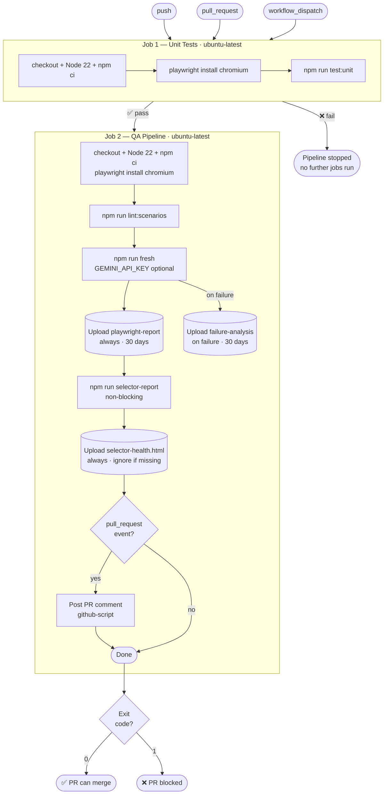
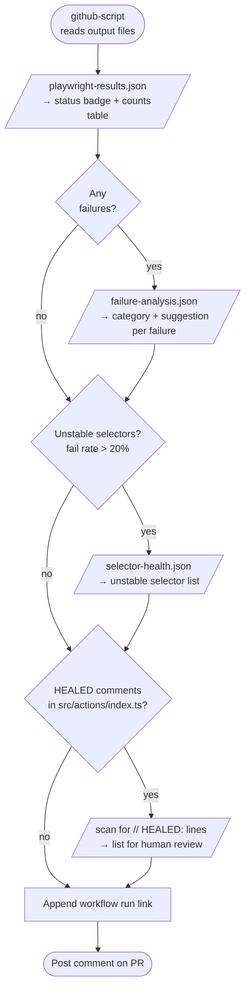

# CI/CD

This document describes the GitHub Actions workflow — triggers, jobs, individual steps, artifacts, PR comment contents, and what can block a merge.

---

## Workflow File

`.github/workflows/qa-pipeline.yml`

---

## CI/CD Flow



---

## Triggers

```yaml
on:
  push:
    branches: ["**"]
  pull_request:
    branches: ["**"]
  workflow_dispatch:
```

| Trigger | When it fires |
|---------|--------------|
| `push` | Any commit pushed to any branch |
| `pull_request` | Any PR opened or updated against any branch |
| `workflow_dispatch` | Manual trigger from the GitHub Actions UI |

---

## Job 1: Unit Tests

**Runs on:** `ubuntu-latest`

### Steps

1. **Checkout** — `actions/checkout@v6`
2. **Node setup** — `actions/setup-node@v6`, Node 22, npm cache enabled
3. **Install dependencies** — `npm ci`
4. **Install Playwright browsers** — `npx playwright install --with-deps chromium`
5. **Run unit tests** — `npm run test:unit`

### What `test:unit` Covers

Unit tests live under `src/*/tests/` and cover:

- `bdd-parser` — parser edge cases (malformed Gherkin, missing steps, multi-scenario files)
- `vocabulary` — term matching correctness, partial match ranking
- `planner` — determinism of the vocabulary-only path
- `code-generator` — generated spec structure and provenance header injection
- `analyzer` — failure categorisation logic
- `app-explorer` — selector priority chain, uniqueness checks, browser cleanup

---

## Job 2: QA Pipeline

**Runs on:** `ubuntu-latest`

**Needs:** `unit-tests` — this job only starts if Job 1 passes.

### Steps

1. **Checkout + Node setup + npm ci + Playwright install** — same as Job 1 steps 1–4

2. **Lint scenarios** — `npm run lint:scenarios`
   - Validates all `.feature` files against the vocabulary
   - Fails the job if any unrecognised steps are found

3. **Run full pipeline** — `npm run fresh`
   - Bypasses all caches for a clean CI run
   - `GEMINI_API_KEY` is read from Actions secrets if set (see below)
   - Vocabulary-only scenarios bypass Gemini entirely — the key is not required for them
   - Exits 1 if any generated spec fails

4. **Upload Playwright report artifact**
   - Path: `playwright-report/`
   - Uploaded: always
   - Retention: 30 days

5. **Upload failure analysis artifact**
   - Path: `output/failure-analysis.json`
   - Uploaded: on failure only
   - Retention: 30 days

6. **Generate selector health report** — `npm run selector-report || true`
   - Non-blocking: the `|| true` means a non-zero exit does not fail the job
   - Writes `output/selector-health.html`

7. **Upload selector health HTML artifact**
   - Path: `output/selector-health.html`
   - Uploaded: always, with `continue-on-error: true` in case the file was not produced
   - Retention: 30 days

8. **Post PR comment** — runs only on `pull_request` events (see below)

---

## PR Comment Contents

When the workflow runs on a pull request, a comment is posted automatically. The comment is regenerated on each push to the PR.



### Status Section

```
✅ PASSED   or   ❌ FAILED

| Total | Passed | Failed | Skipped |
|-------|--------|--------|---------|
|   N   |   N    |   N    |    N    |
```

### Failure Analysis Section

Included only when one or more specs fail.

For each failure:
```
[category] <error summary>
Suggestion: <suggested fix>
```

Categories map to the values written by `analyzeFailures()` into `output/failure-analysis.json`.

### Unstable Selectors Section

Lists any selector from `output/selector-health.json` with a fail rate above 20%.

```
Unstable selectors detected:
- <selector> (fail rate: X%)
```

### [HEALED] Selectors Section

Lists selectors that carry a `// HEALED:` annotation in `src/actions/index.ts`. These were replaced by the healing engine and are flagged here for human review before merging.

```
[HEALED] selectors found in src/actions/index.ts — please review before merging:
- <old selector> → <new selector>
```

### Workflow Link

A link to the full workflow run is included at the bottom of every comment.

---

## GEMINI_API_KEY Handling

The key is provided as a GitHub Actions secret:

```
Repository Settings → Secrets and variables → Actions → New repository secret
Name: GEMINI_API_KEY
```

- Not required for vocabulary-only scenarios — the deterministic resolver handles those without an API call
- Required only when a BDD step in a scenario does not match any vocabulary entry and must be resolved by the LLM (Stage 3 LLM pass)
- If the key is absent and an LLM call is attempted, Stage 3 will error and the pipeline exits 1

---

## What Blocks a PR Merge

| Condition | Blocks merge? |
|-----------|--------------|
| Any unit test failure (Job 1) | Yes |
| Any generated spec failure (`npm run fresh` exits 1) | Yes |
| Lint failures (`npm run lint:scenarios`) | No — informational only |
| Unstable selectors in selector health report | No — informational only |

---

## Artifacts Available After Each Run

| Artifact name | Contents | Retention | Uploaded when |
|---------------|----------|-----------|---------------|
| `playwright-report` | Full Playwright HTML report with traces and screenshots | 30 days | Always |
| `failure-analysis` | `output/failure-analysis.json` | 30 days | On failure only |
| `selector-health-report` | `output/selector-health.html` | 30 days | Always (if the file exists) |
